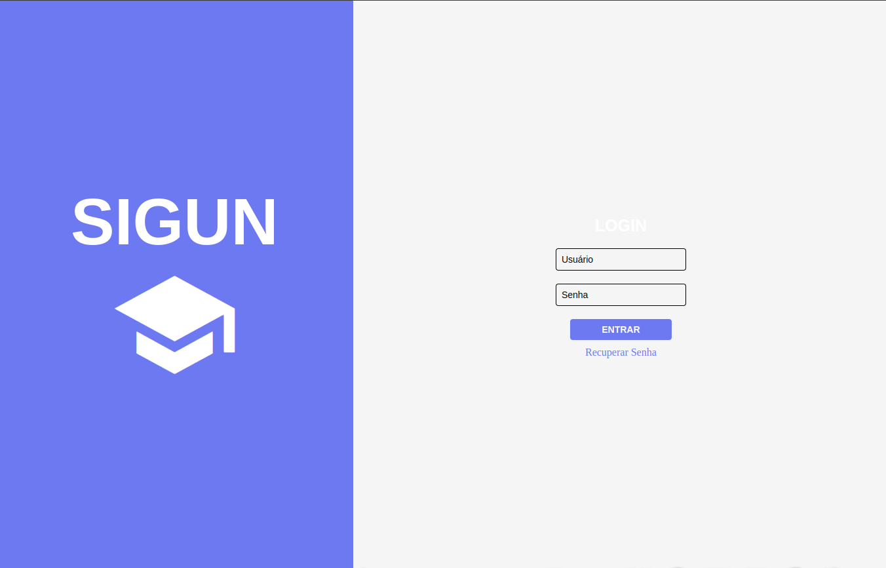
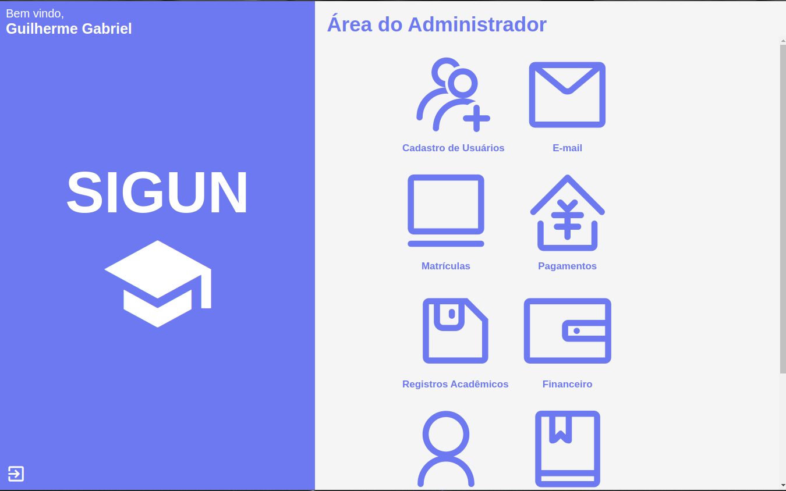

<h1 align="center">
  
</h1>

  <h1 align="center">Sistema de Gestão Universitária</h1>

 

  
  

## :magic_wand: Tecnologias

Esse projeto foi desenvolvido com as seguintes tecnologias:

- [Express.js](https://expressjs.com/)
- [SQLite](https://www.sqlite.org/index.html)
- [Vercel](https://vercel.com/)

## 💻 Projeto

Backend do projeto [sigun](https://github.com/GuilhermeGorges/sigun)

## 🔖 Endpoints

 - Post /login - Autenticacao
 - Post /users - Criacao de usuários
 - Get /functions/:roleName - Obter funções do tipo de perfil
 - Delete /users/:userId - Exclusão de usuários
 - Get /users/:excludeUserId - Listar usuarios, excluindo o solicitante

## :boom: Como executar

- Clone o repositório
- Instale as dependências com `npm i`
- Inicie a backend com `npm start`

Agora faça os passos do [front-end](https://github.com/GuilhermeGorges/sigun) para executar a aplicação.
Ou execute as requisições ao backend via [postmann](https://www.postman.com/).

## 📄 Licença

Esse projeto está sob a licença MIT. Veja o arquivo [LICENSE](LICENSE.md) para mais detalhes.

---

Feito durante o curso de Analise e Desenvolvimento de Sistemas do Senac, como pré-requisito para disciplina de Projeto Integrador. 
